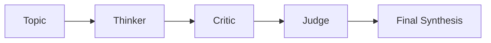

# Experiment 6 - Chatbot

A full-stack AI chatbot application built with a Next.js frontend and a FastAPI backend. The system supports three modes:

- `Ask AI` for general-purpose chat
- `My Avatar` for a grounded Sujal persona
- `Agent Arena` for a structured multi-agent debate

## Demo Architecture

```mermaid
flowchart LR
    U[User] --> F[Next.js Frontend]
    F --> R[/api/chat route]
    R --> B[FastAPI Backend]
    B --> P[Prompt Layer]
    P --> O[OpenAI API]
    O --> B
    B --> R
    R --> F
    F --> U
```

## Agent Arena Flow



## Features

- Multi-mode chat UX in a polished React interface
- Backend API routing with FastAPI
- Persona-grounded avatar mode from local profile data
- LangGraph-powered Thinker-Critic-Judge workflow
- Browser speech synthesis for voice output
- Clean separation between UI, orchestration, and model API calls

## Tech Stack

- Frontend: Next.js, React, TypeScript, Tailwind CSS, shadcn/ui
- Backend: FastAPI, Python
- LLM integration: OpenAI Python SDK
- Agent orchestration: LangGraph
- Voice: browser `SpeechSynthesis`

## Project Structure

```text
Exp 6 Chatbot/
|- backend/
|  |- data/profile.md
|  |- langgraph_arena.py
|  |- main.py
|  |- prompts.py
|  `- requirements.txt
|- frontend/
|  |- app/
|  |- components/
|  |- lib/
|  |- package.json
|  `- package-lock.json
|- start.ps1
`- start.sh
```

## Backend Endpoints

| Endpoint | Purpose |
|---|---|
| `/api/health` | health check |
| `/api/ask` | general AI chat |
| `/api/avatar` | grounded avatar chat |
| `/api/arena` | Thinker-Critic-Judge workflow |

## How It Works

### Ask AI

The backend uses a general system prompt and forwards the conversation to the OpenAI model.

### My Avatar

The backend reads `backend/data/profile.md` and injects that profile into the system prompt so the assistant answers as a grounded persona.

### Agent Arena

LangGraph maintains a shared state with `topic`, `thinker`, `critic`, and `judge`. Each node produces one stage of the reasoning chain.

## Run Locally

### Backend

```bash
cd backend
python -m venv venv
venv\Scripts\activate
pip install -r requirements.txt
uvicorn main:app --reload
```

Create `backend/.env` with:

```env
OPENAI_API_KEY=your_key_here
OPENAI_MODEL=gpt-4o-mini
```

### Frontend

```bash
cd frontend
npm install
npm run dev
```

Set `frontend/.env.local` if needed:

```env
NEXT_PUBLIC_BACKEND_URL=http://127.0.0.1:8000
```

Or use the included start scripts from the experiment root:

```powershell
./start.ps1
```

## Important Notes

- This project does not fine-tune an LLM.
- It uses a hosted OpenAI model through API calls.
- Avatar mode is prompt grounding, not retrieval-augmented generation and not fine-tuning.
- The API key should remain only in `backend/.env` and should never be committed.

## Viva Highlights

- Prompt engineering controls behavior for each mode.
- LangGraph provides explicit multi-step orchestration.
- The frontend never exposes the API key.
- The system is a full-stack AI app, not a rule-based chatbot.
