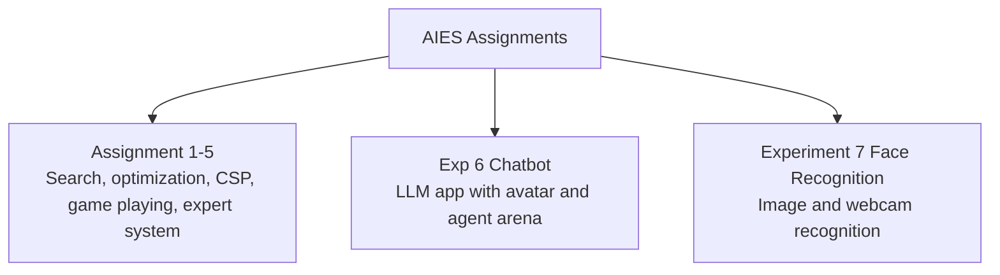

# AIES Lab Assignments

**Course:** Artificial Intelligence and Expert Systems  
**Academic Year:** 2025-2026

This repository contains the lab assignments submitted for the AIES course. It includes classic search and reasoning assignments, a chatbot application, and a face recognition system.

## Repository Map

## Files and Experiments

| Item | Type | Description |
|---|---|---|
| `state_space_search.py` | Study Assignment | BFS and DFS on the 8-puzzle |
| `a_star.py` | Assignment 1 | A* pathfinding |
| `hill_climbing.py` | Assignment 2 | Hill climbing for TSP |
| `csp.py` | Assignment 3 | SEND + MORE = MONEY CSP solver |
| `Assignment4_Minimax_TicTacToe.py` | Assignment 4 | Minimax for Tic-Tac-Toe |
| `Assignment5_Expert_System.pl` | Assignment 5 | Prolog expert system |
| `Exp 6 Chatbot/` | Experiment 6 | Full-stack AI chatbot with three modes |
| `Experiment 7 Face Recognition/` | Experiment 7 | Face recognition from images and webcam |
| `EXPERIMENT_6_7_NOTES.md` | Notes | Viva-oriented explanation of both experiments |

## Existing Assignments

### Study Assignment - State Space Search

Implements BFS and DFS to solve the 8-puzzle. BFS explores level by level and guarantees the shortest path in an unweighted graph. DFS explores depth-first and uses less memory but may miss the shortest path.

### Assignment 1 - A* Algorithm

Implements A* using `f(n) = g(n) + h(n)`, where `g(n)` is the path cost and `h(n)` is the heuristic estimate to the goal.

### Assignment 2 - Hill Climbing

Uses hill climbing with 2-opt swaps for a Traveling Salesman Problem style optimization setup.

### Assignment 3 - Constraint Satisfaction Problem

Solves the cryptarithmetic problem `SEND + MORE = MONEY` by assigning digits under uniqueness and arithmetic constraints.

### Assignment 4 - Minimax

Implements minimax for Tic-Tac-Toe decision making.

### Assignment 5 - Expert System

Implements an expert system in Prolog.

## Experiment 6 - Chatbot

The chatbot is a full-stack AI application with:

- `Ask AI` for general conversation
- `My Avatar` for a grounded persona chatbot
- `Agent Arena` for a Thinker-Critic-Judge reasoning flow

See [`Exp 6 Chatbot/README.md`](./Exp%206%20Chatbot/README.md).

## Experiment 7 - Face Recognition

The face recognition experiment builds a recognition pipeline using:

- dlib for detection, landmarks, and embeddings
- scikit-learn KNN for identity classification
- OpenCV for webcam capture and display

See [`Experiment 7 Face Recognition/README.md`](./Experiment%207%20Face%20Recognition/README.md).

## Viva Notes

Detailed viva preparation notes for both experiments are available in [`EXPERIMENT_6_7_NOTES.md`](./EXPERIMENT_6_7_NOTES.md).
